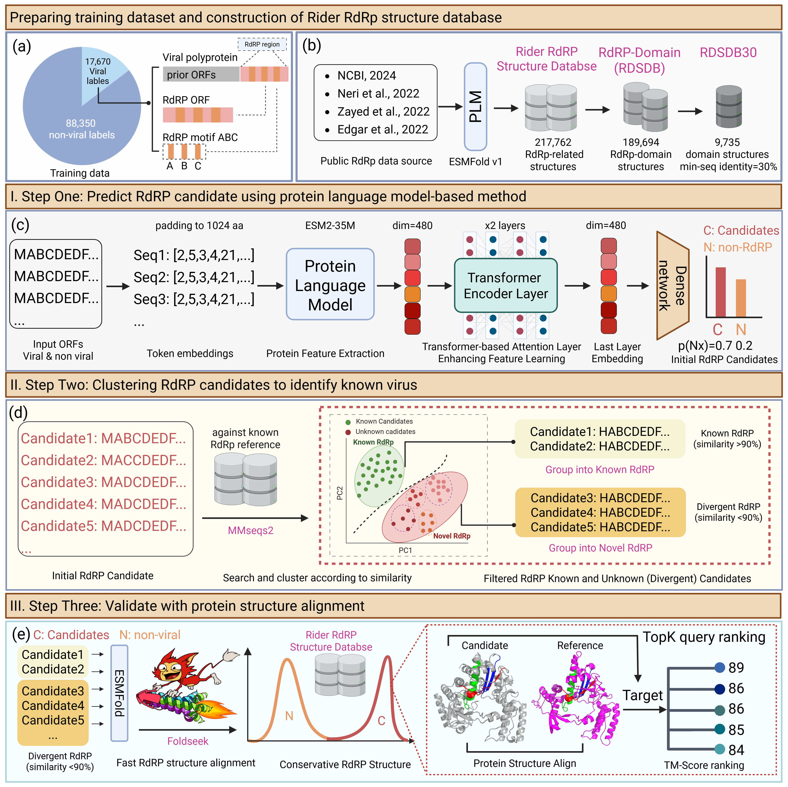

# 🧬 Rider

**Rider** enables fast identification of known and novel RNA viruses from large volumes of metatranscriptomic sequencing data.  
It integrates sequence classification, structure predictcion, and structure alignment into a streamlined pipeline.

We are keeping updating this project...


## 🏗️ Architecture


*Figure 1: Rider pipeline workflow showing the complete data processing flow from input sequences to final virus identification.*

## 🚀 Installation
Two supported ways to prepare the Rider environment:

**A. Developer / reproducible setup (recommended for development)**

This keeps your original env.yaml-based workflow. It recreates the exact conda environment used during development and installs Python packages from requirements.txt.

You can use `git clone` and `conda` to set up the environment:

```bash
# Clone the repository
git clone https://github.com/emblab-westlake/Rider.git
cd Rider

# Create conda environment
conda env create -f env.yaml
conda activate rider

# Install Python-only dependencies (pip)
pip install -r requirements.txt

# Install Rider package in editable mode for development
pip install -e .
```
Notes:

- `env.yaml` installs system/bio tools (mmseqs2, diamond, blast, hmmer, prodigal, entrez-direct) from conda-forge / bioconda so they are available on PATH.
- `requirements.txt` lists many heavy GPU and system packages (torch, triton, deepspeed). Installing them via pip in some systems may fail or produce suboptimal GPU behavior — see the alternative installation below for a safer approach.

**B. Manual Conda Setup (GPU/CPU control; safer for end users; preferred for running pipelines)**

Use conda to install PyTorch (choose CPU or GPU build) and binary tools, then install the Rider package with pip. This avoids pip attempting to build or incorrectly install GPU binaries.
CPU-only example:
```bash
conda create -n rider python=3.10 -y
conda activate rider

# Install PyTorch (CPU-only) via official PyTorch channel
conda install -c pytorch pytorch cpuonly -y

# Install bioinformatics binaries via bioconda/conda-forge
conda install -c conda-forge -c bioconda mmseqs2 foldseek diamond blast hmmer prodigal entrez-direct -y

# Install other Python dependencies (pip) and Rider (editable)
pip install -r requirements.txt --no-deps
pip install -e .
```
GPU example (adjust cudatoolkit to your GPU/cuda compatibility):
```bash
conda create -n rider-gpu python=3.10 -y
conda activate rider-gpu

# Install PyTorch with CUDA support (example uses cudatoolkit=11.8)
conda install -c pytorch pytorch torchvision torchaudio cudatoolkit=11.8 -y

# Install bioinformatics binaries
conda install -c conda-forge -c bioconda mmseqs2 foldseek diamond blast hmmer prodigal entrez-direct -y

# Install other Python deps without re-installing torch/triton/deepspeed (use --no-deps)
pip install -r requirements.txt --no-deps
pip install -e .
```

**Quick verification**

After installation, ensure binaries are available:
```bash
which mmseqs
mmseqs -h
```
Then test Rider CLI (after pip install -e .):
```bash
rider-predict -h
```

## 📁  Step 2. Download and prepare the Rider Dependency
### 📦 Dependency
Rider depends on the following:

- ESM2 (sequence embeddings)
- ESMFold (structure prediction)
- Foldseek (structure alignment)
- Rider structure database (RNA viral protein strucutre reference) (comming soon...)

This database is required for structural alignment using Foldseek (step 6/7).

📥 How to prepare:
1. Download the prebuilt dependencies and database manually (Zenodo: https://doi.org/10.5281/zenodo.19247869) or follow your internal distribution process. We are keep updating.
2. Place it under the Rider folder like this:

✅ Required layout:
```sh
Rider/
└── Submodule/
    └── esmfold_v1/  
    └── esm2_t12_35M_UR50D
    └── foldseek 
└── RDSDB/ #Rider RdRp-domain-specific Database
    └── pdbs/ 
```

Alternatively, pass a custom path using:
```sh
--rdrp_structure_database /your/custom/path/pdbs
```
Note: Foldseek and mmseqs2 are external binaries. Rider attempts to add submodule/foldseek/bin to PATH, but mmseqs2 usually needs separate installation (e.g., conda: `conda install -c bioconda mmseqs2`). Verify with `which mmseqs` and `mmseqs --version`.

## 🗄️ Training and Benchmark Data
The comprehensive datasets used for training the Rider model and benchmarking its performance against other tools (e.g., LucaProt, PalmScan) will be made publicly available upon the official publication of the manuscript.

Currently, the essential alignment databases (RSDB, RDSDB, RDSDB30) and dependency submodules required for running Rider are available on Zenodo:

👉 **[Rider_Dependent_Databases_v1.1](https://doi.org/10.5281/zenodo.19247869)** 

### 🏋️ Model Training
If you wish to retrain the Rider sequence classification model or generate training embeddings from your own custom datasets, we provide the necessary scripts in the src/train_data_generate/ directory.

#### 1. Training Data Generation
The training data generation is split into two main steps:

1. Tokenization (step1_tokenize_fasta_to_pt.py): Converts raw .fasta protein sequences into tokenized PyTorch tensors (.pt) using the ESM2 tokenizer.
2. Embedding Extraction & Dataset Building (step2_build_train_embedding.py): Passes the tokenized sequences through the ESM2 model to extract embeddings and splits them into training and validation sets. It supports both normal and hard_negative sampling modes (incorporating extra negative samples like proteases, capsids, and helicases).
#### How to Run
You can easily execute the entire data generation pipeline using the provided run.sh script. Make sure your raw FASTA files are placed in the correct directory (e.g., train_test_set/) before running.
```sh
cd src/train_data_generate/

# Make the script executable
chmod +x run.sh

# Run the pipeline
./run.sh
```

#### 2. Training the Rider Model
Once the training embeddings (.pt files) are generated and saved in the training_data/ directory, you can train the core Rider classifier (a Transformer-based architecture).

Run the training script:
```sh
# Set the visible GPU and start training
CUDA_VISIBLE_DEVICES=0 python src/training/train_rider.py
```

#### 3. Baseline Models
To facilitate comparison and benchmarking, we also provide training scripts for several baseline models in the src/training/ directory. These can be run similarly to the main Rider model:

- CNN: python src/training/train_cnn.py
- ESM-MLP: python src/training/train_esm_mlp.py
- Random Forest (RF): python src/training/train_rf.py
- Transformer (Standard): python src/training/- train_transformer.py
- XGBoost: python src/training/train_xgb.py


## 🧪 Quick run example
You can run the pipeline using the provided shell script `Rider/run_rider_predict.sh`:

```sh
# Activate the conda environment
# source /root/miniconda3/bin/activate rider
SCRIPT_PATH=$(dirname $(readlink -f "$0"))
# Set input and output paths
# input, output paths and model weights
INPUT_DIR="$SCRIPT_PATH/test_data"                          # input dir
OUTPUT_PATH="$SCRIPT_PATH/test_data/test_results"           # output dir
WEIGHTS="$SCRIPT_PATH/checkpoint/checkpoint-19600/model.safetensors"
RDRP_DB="$SCRIPT_PATH/RDSDB/pdbs" #change this to your own path
SUBMODULE_DIR="$SCRIPT_PATH/submodule"

# Debug output
echo "Using weights from: $WEIGHTS"
echo "Input dir: $INPUT_DIR"
echo "Output dir: $OUTPUT_PATH"

for i in "$INPUT_DIR"/test_AJ004930_1.faa; do
    base=$(basename "$i")
    File_path=$(dirname "$i")
    out_dir="${OUTPUT_PATH}/${base}"
    mkdir -p "${out_dir}"

    echo "Processing: $i"

    # run rider-predict 
    # Set CUDA_VISIBLE_DEVICES to specify which GPU to use
    CUDA_VISIBLE_DEVICES=1 \
    rider-predict \
        -i "$i" \
        -t 32 \
        -w "$WEIGHTS" \
        -b 1 \
        --device cuda \
        -o "$OUTPUT_PATH" \
        --threads 32 \
        --submodule_dir "$SUBMODULE_DIR" \
        --predict_structure \
        --sequence_length 1024 \
        --structure_align_enabled \
        --rdrp_structure_database "$RDRP_DB" \
        --prob_threshold 50 \
        --threshold_type 4 \
        --top_n_mean_prob 5 \
        --alignment-type 1 \
        --threshold 0.9

    echo "Finished: $i"
    echo "--------------------------------------------"
done
```
Arguments explained

- `-i`, `--input_faa` (str, required)
Path to input FASTA file. Each record should be one protein sequence.

- `-w`, `--weights` (str, required)
Path to the classification model weights (safetensors). Default in code: checkpoint/checkpoint-102000/model.safetensors.

- `-b`, `--batch_sizes` (int, default=64)
Batch size for tokenization / feature extraction. Adjust based on GPU memory (≤ 64 suggested for <16GB GPU).

- `-t`, `--threads` (int, default=16)
Number of CPU threads.

- `-o`, `--output_dir` (str, default=./)
Output root directory. The pipeline creates a per-input subdirectory with intermediate and final results.

- `--sequence_length` (int, default=1024)
Tokenizer maximum length. Increase only if necessary and if model supports it.

- `--predict_structure` (flag)
Enable structure prediction (ESMFold). If not set, structure prediction steps are skipped.

- `--structure_model_path` (str)
Path to a custom structure model. If not provided, submodule/esmfold_v1 is used.

- `--threshold` (float, default=0.5)
Classification score threshold to call positive.

- `--device` (str, default="cuda")
Computation device (e.g., "cuda", "cuda:0", "cpu").

- `--negative_sample_path` (str)
Path to negative sample FASTA used to pad batches. Default: databases/false256.faa.

- `--structure_align_enabled` (flag)
Enable Foldseek structural alignment (requires Foldseek binary and Rider PDB database).

- `--rdrp_structure_database` (str)
Path to Foldseek database directory. Required if --structure_align_enabled is set.

- `--alignment-typ`e (int, default=1)
Foldseek alignment type parameter (passed to the alignment runner).

- `--prob_threshold` (int, default=50)
Homology probability threshold (percentage) used to filter Foldseek results.

- `--threshold_type` (int, default=1, choices=[1, 2, 3, 4])
Filtering type: 1=bits, 2=ttmscore, 3=qtmscore, 4=max(ttmscore, qtmscore). For tmscore, the threshold is 'prob_threshold/100'.

- `--top_n_mean_prob` (int, default=1)
Number of top hits to average when computing homology probability. Higher values make validation stricter.

## 📓 Interactive Tutorial

Want a more hands-on, step-by-step guide? We provide an interactive Jupyter Notebook that walks you through the entire Rider pipeline, from setting up the environment to running predictions and visualizing the output tables.

👉 **[Check out the Interactive Tutorial (tutorial.ipynb)](tutorial.ipynb)**

In this notebook, you will learn how to:
- Run the `rider-predict` command step-by-step.
- Understand the logic behind parameter tuning (especially structural alignment thresholds like `--threshold_type`).
- Load and inspect the output files (`final_result_taxonomy_id.txt` and `final_result_taxonomy_id_with_seq.txt`) using `pandas`.

## 📊 Output Format

After a successful run, Rider generates several files in the specified output directory. The most important results are summarized in two tab-separated text files.

### 1. Basic Taxonomy Results (`final_result_taxonomy_id.txt`)
This file contains all alignments that met the initial probability threshold.

| Query_ID | Target_ID | Bits_Score | qTM_score | tTM_score | LDDT | E_value |
| :--- | :--- | :--- | :--- | :--- | :--- | :--- |
| AJ004930.1_2_1;1-90 | Rv4_040347 | 74 | 0.7991 | 0.1936 | 0.78 | 0.483 |
| AJ004930.1_3_1;1-95 | Rv4_142573 | 86 | 0.8984 | 0.2294 | 0.85 | 0.529 |
| lcl\|AJ004930.1_prot_CAA06228.1_1_1;1-718 | Rv4_159529 | 48 | 0.4855 | 0.8688 | 0.61 | 0.658 |

**Column Explanations:**
*   **Query_ID**: The ID of your input sequence (with the `Rider_` prefix removed).
*   **Target_ID**: The matched target sequence ID in the Rider structure database.
*   **Bits_Score**: Foldseek structural alignment bit score (higher is better).
*   **qTM_score**: TM-score normalized by the query length (range 0-1).
*   **tTM_score**: TM-score normalized by the target length (range 0-1).
*   **LDDT**: Local Distance Difference Test score, evaluating local structural accuracy.
*   **E_value**: Expectation value of the alignment.

---

### 2. High-Quality Results with Sequences (`final_result_taxonomy_id_with_seq.txt`)
This file is a strictly filtered subset of the basic results, applying dual-filtering logic based on sequence length and alignment score to ensure high reliability. It also appends the actual amino acid sequences.

| Cleaned_Query_ID | Target_ID | Bits_Score | qTM_score | tTM_score | LDDT | E_value | qstart | qend | start_pos | end_pos | Sequence |
| :--- | :--- | :--- | :--- | :--- | :--- | :--- | :--- | :--- | :--- | :--- | :--- |
| AJ004930.1_2 | Rv4_040347 | 74 | 0.7991 | 0.1936 | 0.78 | 0.483 | 1 | 90 | 1 | 90 | MDGTFNQQAPLNRLVQLYQDGLLHDVEFYS... |
| AJ004930.1_3 | Rv4_142573 | 86 | 0.8984 | 0.2294 | 0.85 | 0.529 | 1 | 95 | 1 | 95 | MLALSHHVIVQIAAMRVGKLPFTNYALLGD... |
| lcl\|AJ004930.1_prot... | Rv4_159529 | 48 | 0.4855 | 0.8688 | 0.61 | 0.658 | 29 | 514 | 1 | 718 | MKRLTLSQNKSNQLTNNDLSNVGYITKQLF... |

**Additional Column Explanations:**
*   **Cleaned_Query_ID**: The base ID of the query with coordinate suffixes removed.
*   **qstart / qend**: The start and end positions of the query in the structural alignment.
*   **start_pos / end_pos**: The parsed coordinates from the original ID string.
*   **Sequence**: The full amino acid sequence extracted from the raw input. *(Note: Truncated in the table above for display purposes).*

## 🔗Cite us
If you find this work useful in your research, please consider citing our paper:

> **Expanding the RNA Virus Universe by Scalable Structure-Guided Discovery**
> <br>
> Gaoyang Luo, Zelin Zang, Ling Yuan, Jingbo Zhou, Ao Dong, Yufei Huang, Stan Z. Li, Feng Ju
> <br>
> *bioRxiv* 2025.11.24.690314; doi: [10.1101/2025.11.24.690314](https://doi.org/10.1101/2025.11.24.690314)

**BibTeX:**

```bibtex
@article{Luo2025Expanding,
  title = {Expanding the RNA Virus Universe by Scalable Structure-Guided Discovery},
  author = {Luo Gaoyang, Zang Zelin, Yuan Ling, Zhou Jingbo, Dong Ao, Huang Yufei, Li Stan Z., Ju Feng},
  journal = {bioRxiv},
  year = {2025},
  doi = {10.1101/2025.11.24.690314},
  url = {https://www.biorxiv.org/content/10.1101/2025.11.24.690314},
  publisher = {Cold Spring Harbor Laboratory}
}
```

